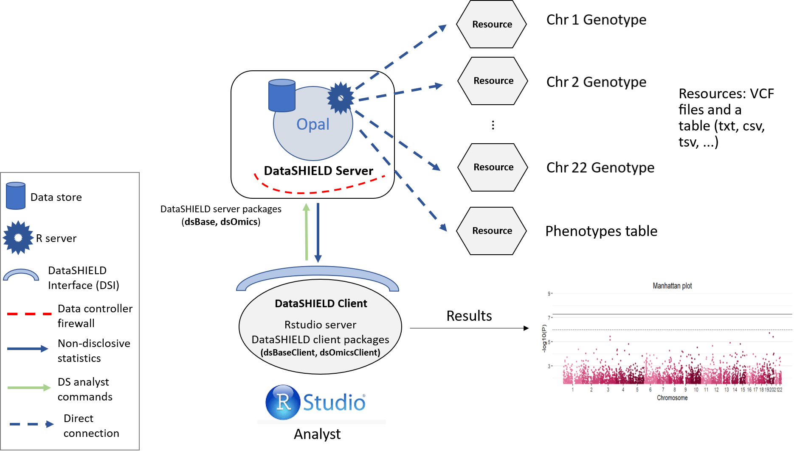
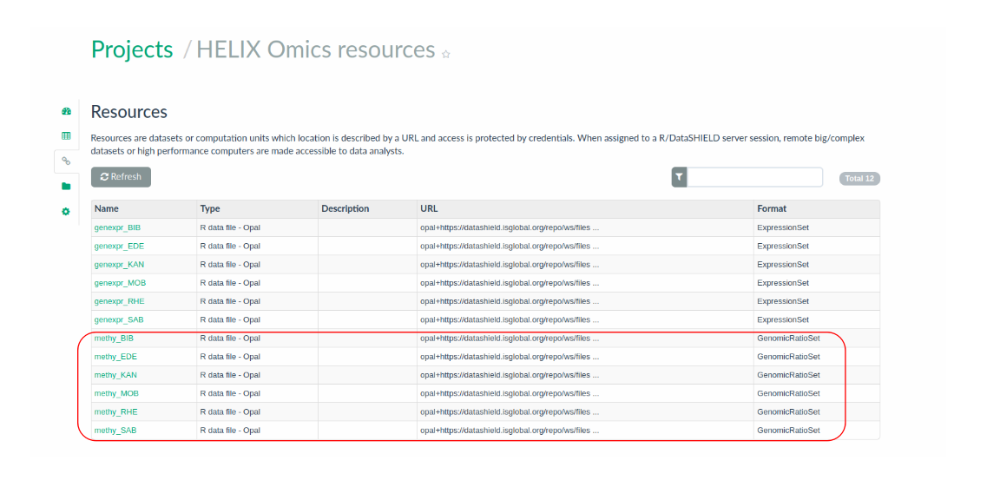

# Datasets description {#DatasetsDescription}

Here, we will **describe the data employed for the analyses presented in the bookdown**, giving details about **experimental designs**, the type of **features available**, and the **structure and organization** of data in the [**Opal infrastructure**](https://opaldoc.obiba.org/en/latest/). Employed data constitute both **public data** downloaded from public repositories, and **real datasets** deriving from an European H2020 research project on exposome and health ([HELIX Project](https://www.projecthelix.eu)). The public datasets have been uploaded to the [Opal demo site](https://opal-demo.obiba.org/) and can be easily accessed without additional permissions. On the other hand, the **HELIX** dataset is available in the [Opal BRGE site](https://datashield.isglobal.org/repo) hosted by the [Bioinformatic Research Group in Epidemiology](https://brge.isglobal.org/) of ISGlobal. In both cases, data are organized in the Opal simulating a **single-site DataSHIELD infrastructure**. Details for **accessing** the server will be found in each section, at the beginning of each pipeline.

## CINECA project {#CINECAdescription}

Data from the public CINECA project were employed in this bookdown for demonstrating the capabilities of dsOmicSHIELD for performing **GWAS and other genetic analyses**. Data correspond to synthetic data set generated by the [CINECA Project](https://www.cineca-project.eu/) made freely available under the Creative Commons Licence (CC-BY) (funding: EC H2020 grant 825775). In **Figure \@ref(fig:figCINECA)**, an overall description of the datasets and cohorts belonging to the **CINECA project** is presented. 

```{r figCINECA, echo=FALSE, fig.cap="The figure depicts CINECA project cohorts representing >1.4 Million individuals and spanning three continents.", fig.align='center'}
knitr::include_graphics("https://images.squarespace-cdn.com/content/v1/5cc2c7b2d86cc9589d33dfcc/1573825882582-AS6SBW8PMXNGKSJWS79H/cohort_figure_updated_Nov2019.png?format=750w")
```

## Data organization in the Opal server {#CINECAopal}

Data were initially accessible from a public EGA repository (ID: [EGAD00001006673](https://ega-archive.org/studies/EGAS00001002472/)), being a deliverable of the [VEIS project](https://veis.bsc.es/en/). Previous to analysis, data were **pruned**, and the individuals were separated into **three synthetic cohorts**. Information on individuals and SNP count of each cohort can be found on the Table \@ref(tab:tab1).

|                       | Cohort 1 | Cohort 2 | Cohort 3 |   Total |
|-----------------------|---------:|---------:|---------:|--------:|
| Number of SNPs        |  865,240 |  865,240 |  865,240 | 865,240 |
| Number of individuals |      817 |    1,073 |      614 |   2,504 |

: (\#tab:tab1) Number of SNPs and individuals by cohort

The three datasets were uploaded to the [Opal demo site](https://opal-demo.obiba.org/) organized as (1) an array of **resource** objects, corresponding to unitary VCF files with variant information (one per chromosome and cohort), and (2) **table** objects corresponding to the phenotype data (one per cohort). Data are in Opal simulating a **single-site DataSHIELD architecture**, as in **Figure \@ref(fig:FigCINECAopal)**. In this figure, the data analyst corresponds to the "RStudio" session, which through the **DataSHIELD Interface (DSI)** connects with the Opal server located at the cohort network. 

```{r FigCINECAopal, echo=FALSE, fig.align = 'center', out.width = "90%", fig.cap="Proposed infrastructure to perform single-cohort GWAS studies.", fig.align='center'}

```

For more information about **DataSHIELD data formats**, please, refers to the bookdown [*"Orchestrating privacy-protected non-disclosive big data analyses of data from different resources with R and DataSHIELD"*](https://isglobal-brge.github.io/resource_bookdown/index.html). 

## TCGA Liver project {#TCGALiverdatadescription}

The public TCGA Liver project was selected for illustrating how to perform **transcriptomic data analysis** in DataSHIELD. These data derived from the famous [TCGA project](https://www.cancer.gov/about-nci/organization/ccg/research/structural-genomics/tcga). We have uploaded to the demo Opal server a resource called `tcga_liver` whose URL is <http://duffel.rail.bio/recount/TCGA/rse_gene_liver.Rdata> available through the [recount project](https://jhubiostatistics.shinyapps.io/recount/). 

Some summaries of the dataset are the following:

|                               | TCGA Liver data |
|-------------------------------|-----------------|
| **Number of individuals**     |    424          |
| **Number of genes**           | 58,037          |
| **Number of covariate fields**|    864          |

The `RangedSummarizedExperiment` (RSE) objects are part of the [BioConductor project](https://www.bioconductor.org/), as a brief summary, these types of objects are designed to contain different multi-omic data, they can also contain the individuals phenotypes and additional metadata associated with a particular experiment. For further information about what are `RangedSummarizedExperiment` please take a look at the [official documentation](https://www.bioconductor.org/packages/devel/bioc/vignettes/SummarizedExperiment/inst/doc/SummarizedExperiment.html)

The resource used on this project contains a `RangedSummarizedExperiment` with the RNAseq profiling of liver cancer data from TCGA. The resource is located inside the `OMICS` project. The structure used is illustrated on the following figure.

```{r dgeProposal1, echo=FALSE, fig.cap="Proposed infrastructure to perform DGE studies.", fig.align='center'}
knitr::include_graphics("fig/dge_structure.png")
```

The data analyst corresponds to the “RStudio” session, which through DataSHIELD Interface (DSI) connects with the Opal server. This Opal server contains a resource that corresponds to the TCGA liver RSE.

## Epigenetic data from the GSE66351 project {#GSE66351description}

The public data from the GSE66351 project were used in this section for illustrating how to perform **EWAS** in DataSHIELD. They has been downloaded from [GEO](https://www.ncbi.nlm.nih.gov/geo/) (accession number GSE66351) and consist on DNA methylation reads from the Illumina 450K array. Data corresponds to CpGs beta values measured in the superior temporal gyrus and prefrontal cortex brain regions of patients with Alzheimer's.

This kind of data is encapsulated on a type of R object called `ExpressionSet`, this objects are part of the [BioConductor project](https://www.bioconductor.org/) and are meant to contain different sources of genomic data, alongside the genomic data they can also contain the phenotypes and metadata associated to a study. Researchers who are not familiar with `ExpressionSet` can find further information [here](https://www.bioconductor.org/packages/release/bioc/vignettes/Biobase/inst/doc/ExpressionSetIntroduction.pdf). Notice that genomic data is encoded as beta-values that ensure data harmonization across studies.

In order to illustrate how to perform data analyses using federated data, we have split the data into two synthetic cohorts (split by individuals). We have created two resources on the demo Opal server called `GSE66351_1` and `GSE66351_2` respectively. They can be found inside the `OMICS` project. The structure used is illustrated on the following figure.

```{r ewasProposal1, echo=FALSE, fig.cap="Proposed infrastructure to perform EWAS studies.", fig.align='center'}
knitr::include_graphics("fig/ewas_structure.png")
```

Some summaries of the datasets are the following:

|                               | Cohort 1 | Cohort 2 |   Total |
|-------------------------------|---------:|---------:|--------:|
| Number of CpGs                |  481,868 |  481,868 | 481,868 |
| Number of individuals         |      100 |       90 |     190 |
| Number of covariates          |       49 |       49 |      49 |
| Number of annotation features |       37 |       37 |      37 |

## HELIX project {#HELIXdescription}

The real-world research problem presented in this book comes from the [HELIX Project](https://www.projecthelix.eu). The **HELIX (Human Early-Life Exposome) project** gathers data from **6 longitudinal-based European birth cohorts**, with the aim of evaluating the effect of **environmental risk factors** on **mothers and children health**, with a special focus in the effects on **molecular health profiles (omic data)**. **HELIX cohorts** include the _BIB_ (Born in Bradford) (United Kingdom), _EDEN_ (Étude des Déterminants pré et postnatals du développement et de la santé de l’ENfant) (France), _INMA_ (INfancia y Medio Ambiente) (Spain), _KANC_ (Kaunus Cohort) (Lithuania), _MoBa_ (Norwegian Mother and Child Cohort Study) (Norway), and _Rhea_ (Mother-Child Cohort in Crete) (Greece). General details of the **study design** of **HELIX** can be found in the **Figure \@ref(fig:FigHELIX)**. The whole **HELIX dataset** includes a total of 31,472 mother-child pairs. Among them, a **subcohort of 1,301 children** (approximately 200 children in each cohort) was selected **here** according to the following criteria of eligibility: 1) age 6 to 11 years; 2) omic data available (including gene expression and EWAS data); 3) complete address history; and 4) no serious health problems that may affect the clinical testing or the child safety. 

```{r FigHELIX, echo=FALSE, fig.align = 'center', out.width = "90%", fig.cap="General overview of the HELIX research project.", fig.align='center'}
knitr::include_graphics("http://www.projecthelix.eu/images/estructura/helix_study.gif")
```

In the **1,301 children**, a wide range of **environmental exposures** were evaluated to define the early-life exposome during **two time periods**: the **prenatal pregnancy period** and **childhood** (age 6 to 11 years). Collected exposures can be organized into three main parts of the **exposome**: **outdoor exposures, chemical exposures measured through biomarkers, and lifestyle factors**. All variables incorporated in the dataset have been appropriately **pre-processed** previous to analysis (outliers removal, normalization, and missing values imputation). Regarding **phenotype data**, a wide range of **health outcomes** are also available for the **childhood** period including phenotypes related to (1) obesity and cardiometabolic health, (2) respiratory health, and (3) cognition and mental health. Finally, **omic data** (mainly **transcriptomic** and **genome-wide DNA methylation data**) are also available in the **childhood** period. The **objective** of this dataset was illustrating a real case study of:

* Differential **gene expression** analysis. 
* Differential **DNA methylation** analysis. 

### Data organization in the Opal server {#HELIXopal}

**Omic** data from the **HELIX project** were uploaded into to the [Opal BRGE site](https://datashield.isglobal.org/brge/ui/index.html) simulating a **single-site DataSHIELD architecture**, as illustrated in **Figure \@ref(fig:FigHELIXopal)**. Data were stored under the form of **resources** (one per cohort and data type). As illustrated in the figure, transcriptomic data) were stored under the form of _expressionSets_ while EWAS data were stored as _GenomicRatioSet_. A summary of the structure and organization of this data in the **Opal** for the **HELIX project** is illustrated in **Figure \@ref(fig:FigHELIXopal)**.

```{r FigHELIXopal, echo=FALSE, fig.align = 'center', out.width = "90%", fig.cap = "Input HELIX datasets organized by cohort in the Opal server."}

```

In the next subsection, we present **extra details** for each of these datasets.

#### Gene expression data {#TranscriptomicsHELIXDatadescript}

The **gene expression** data available for the **HELIX cohorts** correspond to **microarray data** deriving from the _Human Transcriptome Array 2.0_ platform of Affymetrix. These are hosted in the the [Opal BRGE site](https://datashield.isglobal.org/brge/ui/index.html) as _ExpressionSet_ objects. Particularly, one _ExpressionSet_ file per cohort is hosted in the [Opal BRGE site](https://datashield.isglobal.org/brge/ui/index.html) in the form of a **resource**, as presented in the **Figure \@ref(fig:FigHELIXresourcesOpaltranscrip)**. As it can be seen, data are organized within the Opal server in a **project** called **HELIX_omics**.

```{r FigHELIXresourcesOpaltranscrip, echo=FALSE, fig.align = 'center', out.height = "500px", out.width = "3000px", fig.cap = "Input ExposomeSet data organized by cohort in the Opal server as resources."}
knitr::include_graphics("fig/geneexpression_HELIX.png")
```

#### Epigenetic data {#EWASHELIXDatadescript}

The **epigenetic** data available for the **HELIX cohorts** correspond to genome-wide **DNA methylation data** obtained by microarray experiments using the _Infinium HumanMethylation450k_ platform from Illumina. The data format in which these data are hosted in the Opal is the type **GenomicRatioSet**. **GenomicRatioSet** is a extend of the class **SummarizedExperiment** especially designed for DNA methylation data obtained with the _Infinium HumanMethylation450k_ platform, that will be analysed with the associated R package [minfi](http://bioconductor.org/packages/release/bioc/html/minfi.html). This type of data usually contain **pre-processed DNA methylation values** at a genome-wide level, in the form of **M or/and Beta values**, together with the associated **genomic coordinates**. As in the case of **ExpressionSet** types, **GenomicRatioSet** can also incorporate **phenotype** and **metadata** information.

Particularly, one  **GenomicRatioSet** file per cohort is hosted in the [Opal BRGE site](https://datashield.isglobal.org/brge/ui/index.html) in the form of a **resource**, as presented in the **Figure \@ref(fig:FigHELIXresourcesOpalDNAm)**. As it can be seen, data are organized within the Opal server in a **project** called **HELIX_omics**.

```{r FigHELIXresourcesOpalDNAm, echo=FALSE, fig.align = 'center', out.height = "500px", out.width = "3000px", fig.cap = "Input GenomicRatioSet data organized by cohort in the Opal server as resources."}

```


