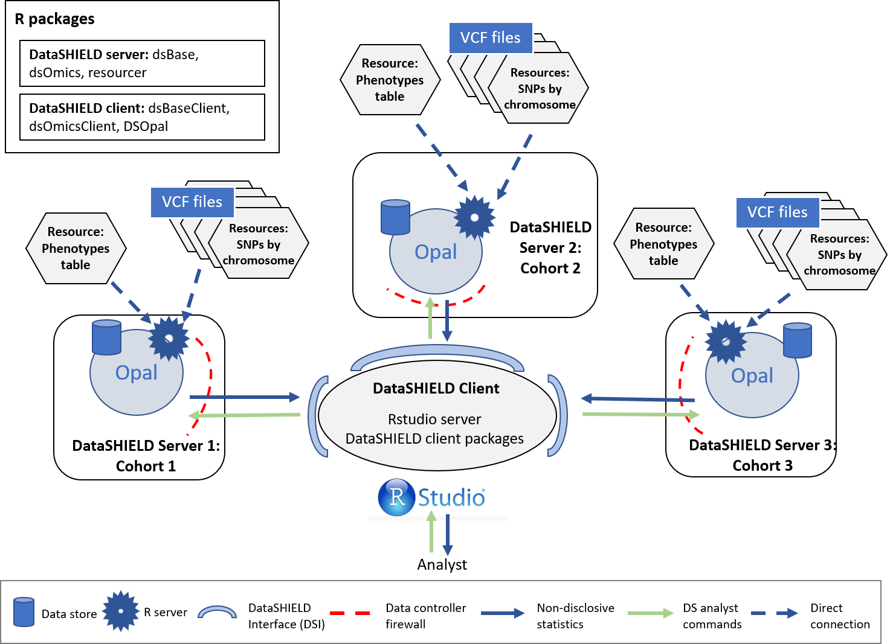

# Exploration of Genotype data

<table><colgroup><col style="width: 100%" /></colgroup><thead><tr class="header"><th style="text-align: left;"><p>`r emo::ji("warning")` RESOURCES USED ALONG THIS SECTION</p></th></tr></thead><tbody><tr class="odd"><td style="text-align: left;"><p>From <a href="https://opal-demo.obiba.org/">https://opal-demo.obiba.org/</a> :</p></td></tr><tr class="even"><td style="text-align: left;"><table><thead><tr class="header"><th><p>STUDY</p></th><th><p>TABLE</p></th><th><p>PROFILE</p></th></tr></thead><tbody><tr class="odd"><td><p>cohort1</p></td><td><p>GWAS.chr{1..21}A</p></td><td><p>omics</p></td></tr><tr
class="odd"><td><p>cohort2</p></td><td><p>GWAS.chr{1..21}B</p></td><td><p>omics</p></td></tr><tr 
class="odd"><td><p>cohort3</p></td><td><p>GWAS.chr{1..21}C</p></td><td><p>omics</p></td></tr><tr 
class="odd"><td><p>cohort1</p></td><td><p>GWAS.ega_phenotypes_1</p></td><td><p>omics</p></td></tr><tr 
class="odd"><td><p>cohort2</p></td><td><p>GWAS.ega_phenotypes_2</p></td><td><p>omics</p></td></tr><tr 
class="odd"><td><p>cohort3</p></td><td><p>GWAS.ega_phenotypes_3</p></td><td><p>omics</p></td></tr><tr 
</tbody></table></td></tr></tbody></table>

Along this section we will illustrate how to get some information about the loaded genotype data and how to perform some basic exploration analysis. Three different aspects will be illustrated:

-   Basic information retrieval
-   Basic statistics calculation
-   Principal component analysis

Information on the data used can be found on the Section (#CINECAopal). We will be working on a virtual scenario with three different cohorts to visualize a real scenario. The same functions can be used in the case of a single cohort.

The study configuration for this section is the following:

```{r multiCohortImage2, echo=FALSE, fig.cap="Proposed infrastructure.", fig.align='center'}

```


## Connection to the Opal server

We have to create an Opal connection object to the different cohorts server. We do that using the following functions.

```{r explor_multi_cohort_ds_login, message=FALSE, warning=FALSE}
require('DSI')
require('DSOpal')
require('dsBaseClient')
require('dsOmicsClient')

builder <- DSI::newDSLoginBuilder()
builder$append(server = "cohort1", url = "https://opal-demo.obiba.org/",
               user =  "dsuser", password = "P@ssw0rd",
               driver = "OpalDriver", profile = "omics")
builder$append(server = "cohort2", url = "https://opal-demo.obiba.org/",
               user =  "dsuser", password = "P@ssw0rd",
               driver = "OpalDriver", profile = "omics")
builder$append(server = "cohort3", url = "https://opal-demo.obiba.org/",
               user =  "dsuser", password = "P@ssw0rd",
               driver = "OpalDriver", profile = "omics")
logindata <- builder$build()
conns <- DSI::datashield.login(logins = logindata)
```

It is important to note that in this use case, we are only using one server that contains all the resources (<https://opal-demo.obiba.org/>), on this server there are all the resources that correspond to the different cohorts. On a more real scenario each one of the `builder$append` instructions would be connecting to a different server.

## Assign the VCF resources {#multi-vcf}

Now that we have created a connection object to the different Opals, we have started three R session, our analysis will take place on those remote sessions, so we have to load the data into them.

In this use case we will use 63 different resources from the `GWAS` project hosted on the [demo Opal server](https://opal-demo.obiba.org/). This resources correspond to VCF files with information on individual chromosomes (21 chromosomes per three cohorts). The names of the resources are `chrXXY` (where XX is the chromosome number and Y is the cohort A/B/C). Following the Opal syntax, we will refer to them using the string `GWAS.chrXXY`.

We have to refer specifically to each different server by using `conns[X]`, this allows us to communicate with the server of interest to indicate to it the resources that it has to load.

```{r explor_multi_cohort_assign_resources, message=FALSE, warning=FALSE, results=FALSE}
# Cohort 1 resources
lapply(1:21, function(x){
  DSI::datashield.assign.resource(conns[1], paste0("chr", x), paste0("GWAS.chr", x,"A"))
  })

# Cohort 2 resources
lapply(1:21, function(x){
  DSI::datashield.assign.resource(conns[2], paste0("chr", x), paste0("GWAS.chr", x,"B"))
  })

# Cohort 3 resources
lapply(1:21, function(x){
  DSI::datashield.assign.resource(conns[3], paste0("chr", x), paste0("GWAS.chr", x,"C"))
  })
```

Now we have assigned all the resources named `GWAS.chrXXY` into our remote R session. We have assigned them to the variables called `chrXX`. To verify this step has been performed correctly, we could use the `ds.class` function to check for their class and that they exist on the remote sessions.

```{r explor_multi_cohort_check_class_resource}
ds.class("chr1")
```

We can see that the object `chr1` exists in all the three servers.

Finally the resources are resolved to retrieve the data in the remote sessions.

```{r explor_multi_cohort_resolve_resources, message=FALSE, warning=FALSE, results=FALSE}
lapply(1:21, function(x){
  DSI::datashield.assign.expr(conns = conns, symbol = paste0("gds", x, "_object"),
                            expr = as.symbol(paste0("as.resource.object(chr", x, ")")))
})
```

Now we have resolved the resources named `chrXX` into our remote R sessions. The objects retrieved have been assigned into variables named `gdsXX_object`. We can check the process was successful as we did before.

```{r explor_multi_cohort_check_class}
ds.class("gds1_object")
```

## Assign the phenotypes {#assign-the-phenotypes-1}

The objects we have loaded into our remote sessions are VCF files that contain genomic information of the individuals. To perform a GWAS this information has to be related to some phenotypes to extract relationships. Therefore, we need to load the phenotypes into the remote sessions. The phenotypes information is a table that contains the individuals as rows and phenotypes as columns. In this use case, we will use a resource (as with the VCF files) to load the phenotypes table into the remote sessions.

As with the VCF resources, here we load a different resource to each cohort, as it is expected that each cohort has only the phenotypes information regarding their individuals, therefore different tables. Note that we are assigning the resource to the same variable at each server (`pheno`), so we only need one function call to resolve all the resources together.

```{r explor_multi_cohort_assign_covariates_table}
# Cohort 1 phenotypes table
DSI::datashield.assign.resource(conns[1], "pheno", "GWAS.ega_phenotypes_1")

# Cohort 2 phenotypes table
DSI::datashield.assign.resource(conns[2], "pheno", "GWAS.ega_phenotypes_2")

# Cohort 3 phenotypes table
DSI::datashield.assign.resource(conns[3], "pheno", "GWAS.ega_phenotypes_3")

# Resolve phenotypes table
DSI::datashield.assign.expr(conns = conns, symbol = "pheno_object",
                            expr = quote(as.resource.data.frame(pheno)))
```

We can follow the same analogy as before to know that we have assigned the phenotypes table to a variable called `pheno_object` on the remote R session.

```{r explor_multi_cohort_check_class_table}
ds.class("pheno_object")
```

We can also check the column names to see which information is present on the table.

```{r}
ds.colnames("pheno_object")[[1]]
```

## Merge VCF (genotype) and phenotype information {#merge-vcf-genotype-and-phenotype-information}

Arrived at this point, we have 21 VCF objects at each cohort R session (each one corresponds to a chromosome) and a phenotypes table. The next step is merging each of the VCF objects with the phenotypes table. The same procedure as the [single cohort](#vcf_merge) can be applied to extract the arguments required.

With all this information we can now merge the phenotypes and VCF objects into a type of object named GenotypeData. We will use the `ds.GenotypeData` function.

```{r explor_multi_cohort_create_genoData, message=FALSE, warning=FALSE, results=FALSE}
lapply(1:21, function(x){
  ds.GenotypeData(x=paste0('gds', x,'_object'), covars = 'pheno_object', 
                  columnId = "subject_id", sexId = "sex",
                  male_encoding = "male", female_encoding = "female",
                  case_control_column = "diabetes_diagnosed_doctor", 
                  case = "Yes", control = "No",
                  newobj.name = paste0('gds.Data', x), datasources = conns)
})
```

The objects we just created are named `gds.DataXX` on the remote session. Now we are ready to perform the exploration analysis on the data we just loaded on the remote sessions.

## Basic information of the Genotype data {#basic-info}

Once we have everything loaded in the remote R sessions, we can begin a simple exploratory analysis by checking basic information. We can check the following:

-   The number of variants, chromosome and individuals
-   The available phenotypes (only applies if we have merged phenotypes information)
-   Get the available SNP rs IDs

To get the number of variants and individuals:

```{r genoDimensions}
dimensions <- do.call(rbind, lapply(1:21, function(x){
  data.frame(ds.genoDimensions(paste0('gds.Data', x)))
}))

data.frame(dimensions)
```

To get the available phenotypes:

```{r genoVariables}
ds.varLabels('gds.Data1')
```

To get the SNP rs IDs:

```{r genoSNPs}
head(ds.getSNPs('gds.Data1'))
```

## Basic statistics of the genotype data

We have also developed functions to compute statistics of the genotype data, the statistics implemented on `dsOmicsClient` are:

-   Allele frequencies. Brief definition (by Nature)[https://www.nature.com/scitable/definition/allele-frequency-298/#:~:text=An%20allele%20frequency%20is%20calculated,a%20percentage%2C%20or%20a%20fraction.].
-   Hardy-Weinberg Equilibrium testing. Information on the test can be found (here)[https://www.sciencedirect.com/science/article/pii/S0002929707607356https://www.sciencedirect.com/science/article/pii/S0002929707607356].

To get the allele frequencies we have two different methods, to obtain the pooled frequencies or to obtain them by study server:

```{r genoAlleleFreq}
# Pooled allele frequencies
ds.alleleFrequency(paste0('gds.Data', 1:21))

# By-study allele frquencies
ds.alleleFrequency(paste0('gds.Data', 1:21), type = "split")
```

To do the Hardy-Weinberg Equilibrium testing is not implemented to get the pooled results as the allele frequency, we can only get the results from each server independently.

```{r genoHEWtesting}
do.call(rbind, lapply(1:21, function(x){
  as_tibble(ds.exactHWE(paste0('gds.Data', x)))
}))
```

## Principal component analysis

We have implemented a pooled component analysis method into OmicSHIELD. This function will create new phenotypes on the GenotypeData objects with the principal components results, so we can later adjust our analysis.

```{r pcaExploration}
pca_res <- ds.PCA(paste0('gds.Data', 1:21), standardize = F)
```

The principal component results can also be visualized using the available grouping variables (categorical) present on the GenotypeData objects used on the `ds.PCA` function.

```{r pcaplotExploration}
dsOmicsClient::plotPCA(pca_res, group = "sex")
```

Or we can visualize the results with no groupings.

```{r pcaplotExploration2}
dsOmicsClient::plotPCA(pca_res)
```

```{r}
datashield.logout(conns)
```

# (PART) Workflows {.unnumbered}