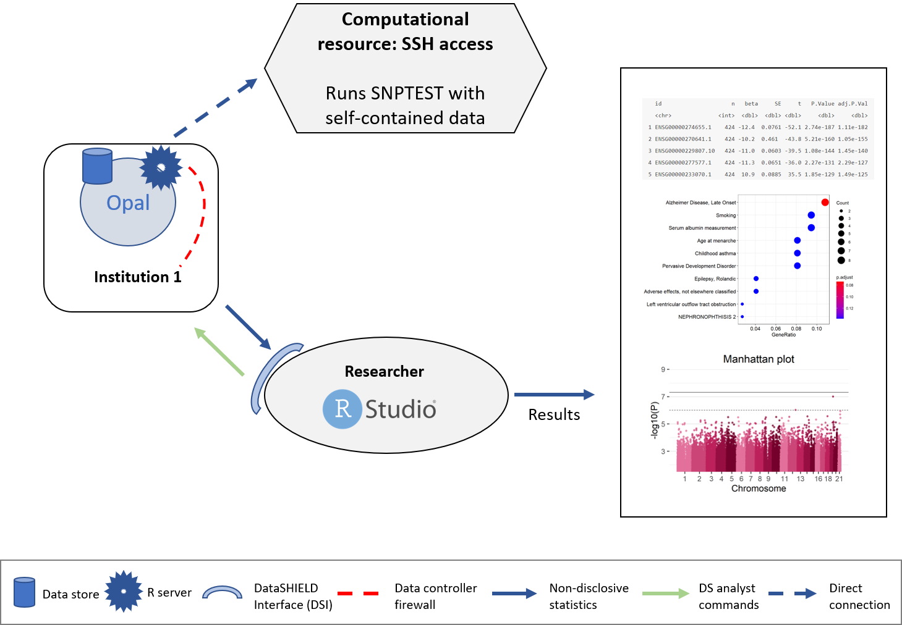

# PLINK

A simple association test use case will be illustrated in this section to portrait the usage of PLINK in OmicSHIELD.

<table><colgroup><col style="width: 100%" /></colgroup><thead><tr class="header"><th style="text-align: left;"><p>`r emo::ji("warning")` RESOURCES USED ALONG THIS SECTION</p></th></tr></thead><tbody><tr class="odd"><td style="text-align: left;"><p>From <a href="https://opal-demo.obiba.org/">https://opal-demo.obiba.org/</a> :</p></td></tr><tr class="even"><td style="text-align: left;"><table><thead><tr class="header"><th><p>STUDY</p></th><th><p>TABLE</p></th><th><p>PROFILE</p></th></tr></thead><tbody><tr class="odd"><td><p>cohort1</p></td><td><p>RSRC.brge_plink</p></td><td><p>omics</p></td></tr><tr
</tbody></table></td></tr></tbody></table>

The structure followed is illustrated on the following figure.

```{r plinkImage, echo=FALSE, fig.cap="Proposed infrastructure for PLINK analysis.", fig.align='center'}

```

The data analyst corresponds to the "RStudio" session, which through DataSHIELD Interface (DSI) connects with the Opal server located at the cohort network. This Opal server contains a resource with the URL where the computational resource is located, also the access credentials are kept secret inside the resource and only the Opal administrator has access to them. A connection to this computational resource is created on the Opal server and the aggregated results are passed to the analyst.

## Connection to the Opal server

We have to create an Opal connection object to the cohort server. We do that using the following functions.

```{r GWAS_shell_1}
library(DSOpal)
library(dsBaseClient)
library(dsOmicsClient)
builder <- newDSLoginBuilder()
builder$append(server = "study1", url = "https://opal-demo.obiba.org",
               user = "dsuser", password = "P@ssw0rd",
               resource = "RSRC.brge_plink",
               profile = "omics")
logindata <- builder$build()
conns <- datashield.login(logins = logindata, assign = TRUE,
                          symbol = "client")
```

## Build the PLINK call

Now, we are ready to run any PLINK command from the client site. Notice that in this case we want to assess association between the genotype data in bed format and use as phenotype the variable 'asthma' that is in the file 'brge.phe' in the 6th column. The sentence in a PLINK command would be (NOTE: we avoid --out to indicate the output file since the file will be available in R as a tibble). The arguments must be encapsulated in a single character without the command 'plink'.

```{r GWAS_shell_4}
plink.arguments <- "--bfile brge --logistic --pheno brge.phe --mpheno 6 --covar brge.phe --covar-name gender,age"
```

## Call the analysis

Then, the analyses are performed by:

```{r GWAS_shell_gwas}
ans.plink <- ds.PLINK("client", plink.arguments)
```

The object `ans.plink` contains the PLINK results at each server as well as the outuput provided by PLINK

```{r GWAS_shell_result1}
  lapply(ans.plink, names)
  
  head(ans.plink$study1$results)
  
  ans.plink$study$plink.out
```

```{r close_conns4}
datashield.logout(conns)
```

# SNPTEST

```{r echo=FALSE, eval=FALSE}
snptest <- newResource(
  name = "snptest",
  url = "ssh://snptest-demo.obiba.org:2223/home/master/data?exec=ls,snptest",
  identity = "master",
  secret = "nSATfSy9Y8JAo5zK",
  format = NULL
)
```


A simple association test use case will be illustrated in this section to portrait the usage of SNPTEST in OmicSHIELD.

<table><colgroup><col style="width: 100%" /></colgroup><thead><tr class="header"><th style="text-align: left;"><p>`r emo::ji("warning")` RESOURCES USED ALONG THIS SECTION</p></th></tr></thead><tbody><tr class="odd"><td style="text-align: left;"><p>From <a href="https://opal-demo.obiba.org/">https://opal-demo.obiba.org/</a> :</p></td></tr><tr class="even"><td style="text-align: left;"><table><thead><tr class="header"><th><p>STUDY</p></th><th><p>TABLE</p></th><th><p>PROFILE</p></th></tr></thead><tbody><tr class="odd"><td><p>cohort1</p></td><td><p>RSRC.brge_snptest</p></td><td><p>omics</p></td></tr><tr
</tbody></table></td></tr></tbody></table>

The structure followed is illustrated on the following figure.

```{r snptestImage, echo=FALSE, fig.cap="Proposed infrastructure for SNPTEST analysis.", fig.align='center'}

```

The data analyst corresponds to the "RStudio" session, which through DataSHIELD Interface (DSI) connects with the Opal server located at the cohort network. This Opal server contains a resource with the URL where the computational resource is located, also the access credentials are kept secret inside the resource and only the Opal administrator has access to them. A connection to this computational resource is created on the Opal server and the aggregated results are passed to the analyst.

## Connection to the Opal server

We have to create an Opal connection object to the cohort server. We do that using the following functions.

```{r snptest_1}
library(DSOpal)
library(dsBaseClient)
library(dsOmicsClient)
builder <- newDSLoginBuilder()
builder$append(server = "study1", url = "https://opal-demo.obiba.org",
               user = "dsuser", password = "P@ssw0rd",
               resource = "RSRC.brge_snptest",
               profile = "omics")
logindata <- builder$build()
conns <- datashield.login(logins = logindata, assign = TRUE,
                          symbol = "client")
```

## Build the SNPTEST call

Now, we are ready to run any SNPTEST command from the client site. Notice that in this case we want to assess association between the genotype data in gen format and use as phenotype the variable 'bin1' that is in the file 'sample', which is a binomial variable (case/control). The sentence in a SNPTEST command would be (NOTE: we avoid -o to indicate the output file since the file will be available in R as a tibble). The arguments must be encapsulated in a single character without the command 'snptest'.

```{r snptest_2}
snptest.arguments <- "-frequentist 1 -method score -pheno bin1 -data cohort1.gen cohort1.sample cohort2.gen cohort2.sample"
```

## Call the analysis

Then, the analyses are performed by:

```{r snptest_3}
ans.snptest <- ds.snptest("client", snptest.arguments)
```

The object `ans.snptest` contains the SNPTEST results at each server as well as the outuput provided by the command

```{r snptest_4}
lapply(ans.snptest, names)
  
head(ans.snptest$study1$results)
  
ans.snptest$study$snptest.out
```

```{r close_conns5}
datashield.logout(conns)
```