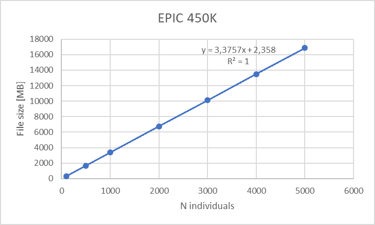
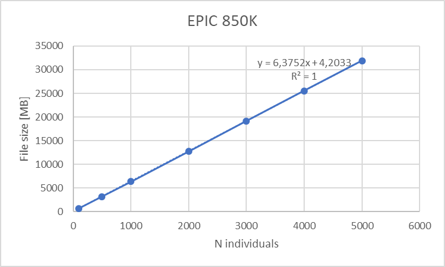
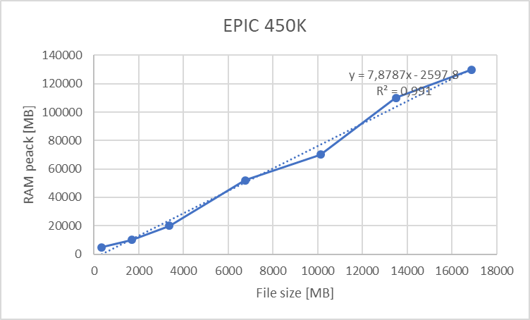
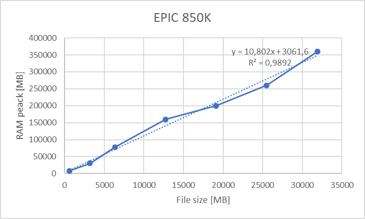
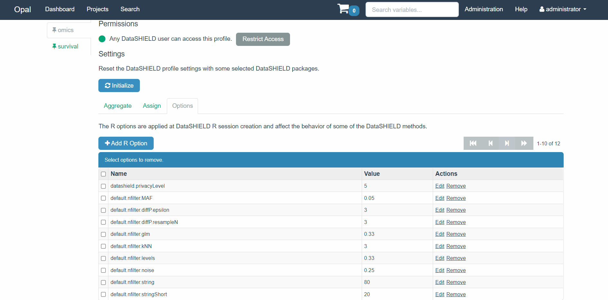

# (PART) Technical details {-}

# Fast GWAS

The method implemented for the fast GWAS is based on the research by @sikorska2013gwas We adapted their algorithm to our infrastructure to perform a fast pooled GWAS. Our implementation is described in the following pseudo-code:

******
**Step 1**: Fit the objective model^[Model obtained using `dsBaseClient::ds.glm`]

******
1.  Iteratively each `DP_i`^[`DP_i`: Data processor (Opal node)] extracts the coefficients of objective model
2.  Client sends to each `DP_i` the coefficient values
3.  Each `DP_i` computes the fitted values and residuals [`FIT_i`, `RES_i`]

******
**Step 2**: Using the residuals and genotype information [`RES_i`, `GEN_i`]

******
1.  Each DP_i computes `RES_i - mean(RES_i) :> YC_i`
2.  Each DP_i computes `colSums(YC_i * GEN_i); colSums(GEN_i); colSums(GEN_i ^ 2)` and returns to the client [`B_i`, `S1_i`, `S2_i`]
3.  The client merges [`B_i`, `S1_i`, `S2_i`] into [`B`, `S1`, `S2`]
4.  The client computes the total number of individuals :> `N_IND`

******
**Step 3**: Using [`B`, `S1`, `S2`, `N_IND`, `YC_i`] compute betas and pvalues

******
1.  The client computes `S2 - (S1 ^ 2) / N_IND :> DEN1`
2.  The client computes `B / DEN1 :>` BETA to obtain the beta values
3.  Each `DP_i` computes `colSums(YC_i ^ 2)` and returns to client :> `YC2_i`
4.  The client merges `YC2_i :> YC2`
5.  The client computes `(YC2 - BETA ^ 2 * DEN1) / (N_IND - K - 2) :> SIGMA`
6.  The client computes `sqrt(SIGMA * (1 / DEN1)) :> ERR`
7.  The client computes `2 * pnorm(-abs(BETA / ERR)) :> PVAL` to obtain the pvalues

******

The data that is being shared to the client is always a result of an aggregation (i.e. column sums and different products). For that reason, we added some disclosure controls that guarantee that the aggregated data has a minimum of valid points to prevent data leaks (e.g. returning aggregates of a single individual will leak its data). It must be noted that the performance is limited by the slowest server, therefore increasing the amount of data providers to the study does not imply increasing the computational time, as all servers work in parallel. 

# PCA

To compute a pooled PCA using horizontally partitioned data, the block method singular value decomposition has been implemented @berry2005parallel. The pseudo-code of the algorithm is as follows:

******
**Step 1**: Intermediate SVD^[Singular value decomposition]

******
1.  Each `DP_i`^[`DP_i`: Data processor (Opal node)] computes SVD(geno^[Encoded genotype data]) [`u_i`, `v_i`, `d_i`]
2.  Each `DP_i` computes `u_i * d_i [res_i]`
3.  Each `DP_i` returns `res_i` to the client

******
**Step 2**: Client aggregation

******
1.  The client receives res_i and merges it horizontally [aggregated]
2.  The client computes SVD(aggregated) [final_results]
3.  The client returns the pooled PCA results [final_results]

******

The algorithm used returns to the client the product of the left singular vectors (`u_i`) and singular values (`d_i`). This guarantees that the original data contained on each node is not reconstructible (i.e. we only share non-disclosive information among servers). 

This is a general method to compute PCA. We have adapted this approach to allow performing PCA on genotype data. To this end, these two extra steps have been implemented.

-  Genotype standardization: $\frac{X_{ij} - 2 \mu_{j}}{\sigma_j}$, where the genotype is $X_ij$ ($i$ is the individual index, $j$ is the SNP index), $\mu_j=2p_j$ is the mean of the 0,1,2-coded genotype ($p_j$ being the alternate allele frequency), and $\sigma_j$ is the expected standard error under Hardy-Weinberg Equilibrium, that is $\sqrt{2p_j (1-p_j)}$.
-  Perform PCA using only selected SNPs that have been linked to differentiate ethnic groups @huang2015genetic.

# Differential privacy

Differential privacy can be briefly described as an algorithm that if the output is observed, we can’t tell if an individual information has been used. This concept was introduced by @dwork2014algorithmic. Formally, this concept is referred to as $\epsilon$-differential privacy and it is mathematically expressed as:

$$Pr[A(D_1)=S]≤exp(\epsilon)\cdot Pr[A(D_2)=S]$$


Where A is a randomized algorithm that takes a dataset D as input, and $\epsilon$ is the privacy parameter that defines the level of privacy (as closer to 0 more privacy).

In order to implement differential privacy into our software, the Laplace mechanism has been used. This mechanism adds noise to the output of a function, the noise is drawn from a Laplace distribution with mean 0 and scale $\Delta f/\epsilon$, where $\Delta f$  if the $l_1$ sensitivity defined by:

$$\Delta f = max_{D_1, D_2} ||f(D_1) - f(D_2)||$$

The assessment of $\Delta f$ can be particularly complex for certain functions (e.g. limma + voom), for that reason a sampling method @rubinstein2017pain has been used to assess $\Delta f$. Since the number of resamples performed can potentially impact the differential privacy quality, we allow the data owner to configure this parameter into the Opal server.

For the specific case of fast GWAS, the differential privacy methods can severly affect random SNPs, for that reason we included a `resample` argument inside of the function to perform the analisis `resample` times and get the median values.

# Internal structure of the PRS functionality

The PRS function can be divided into three main blocks that perform the required tasks to come up with the results. The three functional blocks are the following:

-   Client: Assemble the `prs_table` table if PGS Catalog is used, perform calls to the server to subset the resources and calculate the PRS with the subsetted resources.
-   Server resolver: Resolve the selected resources (VCF files) and subset them using the prs_table.
-   Server analysis: Use the resolved resources (small VCF files with only the SNPs of interest according to the `prs_table` table) to calculate the PRS.

In order to introduce a little how those three blocks work internally, schematized flow charts have been designed. To understand the exact inner working of the functionality it is advised to follow the flowcharts alongside the actual source code. Find the links to the three blocks source code, [client](https://github.com/isglobal-brge/dsOmicsClient/blob/master/R/ds.PRS.R), [server resolver](https://github.com/isglobal-brge/dsOmics/blob/master/R/GDSFileResourceClient.R#L43) and [server analysis](https://github.com/isglobal-brge/dsOmics/blob/master/R/PRSDS.R).

## Client

The client performs two basic tasks. The first one is to select between a user introduced `prs_table` or to retrieve the `prs_table` from the PGS Catalog. Please note that `prs_table` stands for Region Of Interest, which may not be the common term for PGS analysis but it makes sense since it refers to a table that contain the SNP's of interest and their weight to the score. If the user introduces a custom `prs_table` and a PGS Catalog ID, only the introduced table will be used, discarding the PGS Catalog ID information. Once this table is assembled, the next step is to call the required functions on the study servers. First, the resource resolver is called, and after that, the function that calculates the PRS is called.

This is illustrated on the following figure.

```{r block10Image, echo=FALSE, fig.cap="Flow chart of the client block.", fig.align='center'}
knitr::include_graphics("fig/block1.png")
```

## Server resolver

The server resolver is in charge of resolving the resources. The interesting aspect is that only a region of interest is actually assigned to the R session, this is to avoid overloading the memory with unnecessary information. There are two different methodologies to perform this subsetting, one is using chromosome names and position and the other is using the SNP id's. Due to the technical specification of VCF files, is much easier to perform the subsetting using chromosome names and positions because there is an indexing file for the VCF files to perform fast queries of regions by position. On the other hand, to filter a VCF file using SNP id's, the whole file has to be scanned, yielding a much slower process.

This block is illustrated on the following figure.

```{r block20Image, echo=FALSE, fig.cap="Flow chart of the server resolver block.", fig.align='center'}
knitr::include_graphics("fig/block2.png")
```

## Server analysis

Many processes are performed inside the analysis block. For that reason, more than a flow chart, a step by step guide has been illustrated with the objects that are created (or modified) on each step. The most important step on this block is making sure that the alternate (risk) alleles match between the VCF resources and the alternate alleles stated by the `prs_table` or PGS Catalog.

The block is illustrated on the following figure.

```{r block30Image, echo=FALSE, fig.cap="Flow chart of the server analysis block.", fig.align='center'}
knitr::include_graphics("fig/block3.png")
```

# Compression of GDS files vs. performance {#compress}

When working with genotype data, OmicSHIELD offers the possibility of using VCF and GDS formats. When a VCF is supplied, internally is converted to a GDS to work with it, for that reason it is always better to start with a GDS to improve the performance of the pipeline.

When converting to GDS using [gdsfmt](https://bioconductor.org/packages/release/bioc/html/gdsfmt.html), there are many compression options that will affect the final file size. This compression comes with an added cost, which is the read time. For very aggressive compression typically the reading time gets severely affected, so it is good to find a good balance. To help choosing the right compression we provide a comparison table between all the compression options, the table has been extracted from the [official documentation](https://bioconductor.org/packages/release/bioc/vignettes/gdsfmt/inst/doc/gdsfmt.html) of the `gdsgmt` package.

| Compression Method    | Raw  | ZIP    | ZIP_ra | LZ4   | LZ4_ra | LZMA  | LZMA_ra |
|:----------------------|:-----|:-------|:-------|:------|:-------|:------|:--------|
| Data Size (MB)        | 38.1 | 1.9    | 2.1    | 2.8   | 2.9    | 1.4   | 1.4     |
| Compression Percent   | 100% | 5.08%  | 5.42%  | 7.39% | 7.60%  | 3.65% | 3.78%   |
| Reading Time (second) | 0.21 | 202.64 | 2.97   | 84.43 | 0.84   | 462.1 | 29.7    |

At ISGlobal we are using the `LZ4_ra` compression method because it provides a very good compression level with the least effect to the reading time.

# Recommended R server specs

We conducted some stress tests to assess the maximum allocated RAM and HDD space consumed by the analysis portraited on this bookdown.

## Limma + voom

For epigenomics and differential gene expression analysis we portrayed the use of limma + voom. The disk space consumed by the ExpressionSets used is dependent on the array dimensions and the number of individuals, and so is the RAM allocation; this yields the following table:

| Array     | Individuals | Storage [GB] | RAM [GB] |
|-----------|-------------|--------------|----------|
| EPIC 450K | 100         | 0,34         | 3        |
| EPIC 450K | 500         | 1,7          | 12       |
| EPIC 450K | 1000        | 3,4          | 24       |
| EPIC 450K | 2000        | 6,8          | 48       |
| EPIC 850K | 100         | 0,64         | 8        |
| EPIC 850K | 500         | 3,2          | 36       |
| EPIC 850K | 1000        | 6,4          | 72       |
| EPIC 850K | 2000        | 12,8         | 144      |

This table can be summarized on the following graphs:

```{r e450hdd2, echo=FALSE, fig.cap="Disk space requirements for EPIC 450K array versus number of individuals (10 meta-variables)", fig.align='center'}

```

```{r e850hdd2, echo=FALSE, fig.cap="Disk space requirements for EPIC 850K array versus number of individuals (10 meta-variables)", fig.align='center'}

```

```{r e450ram2, echo=FALSE, fig.cap="Maximum allocated RAM for EPIC 450K array versus number of individuals (1 adjustin covariable)", fig.align='center'}

```

```{r e850ram2, echo=FALSE, fig.cap="Maximum allocated RAM for EPIC 850K array versus number of individuals (1 adjustin covariable)", fig.align='center'}

```

We can clearly see a lineal correlation to estimate the hardware requirements.

## GWAS + PCA

Genomic data is accepted in OmicSHIELD as `gds` files, which can be compressed using different algorithms, therefore it makes no sense to extract any relationship between individuals / number of variants and file size. Please refer to [the appropiate section](#compress) for information about that.

Also, the methodologies used (both pooled and meta-analysis) are not as RAM dependent as Limma analysis. This has to do with the nature of genomic data, which is typically extremely large; to analyze this kind of data we do not load it entirely on the RAM, the algorithms perform clever techniques that read portions of the data at a time, and the size of that portion can be configured by the user (see the argument `snpBlock`), therefore the researchers can tune the function calls if RAM limits become an issue.

## General remarks

On top of this information some details must be noted:

+ Disk space (storage) is cheap and easy to upgrade, RAM is expensive. Therefore storage requirements should be easy to fulfill and RAM requirements may require a steeper investment.
+ The server has to perform the analysis AND host the Opal/Armadillo + R server. For reference, our deployment, which contains Apache + Opal + 4 x R servers, allocates 5 GB of RAM memory.
+ Results are approximate, it is advisable to apply a security coefficient (especially on the RAM) of about 1.5 to be safe.
+ Imputed GWAS data can be quite heavy on disk space, however it is not that heavy on RAM usage (https://www.well.ox.ac.uk/~gav/snptest/#other_options chunk flag).
+ Methylation data in contrast is more RAM intensive when being analyzed.
+ There is no queuing system implemented at the moment, so if multiple people are conducting analyses at the same time, the performance of the system will be compromised.
+ If possible, get more RAM and storage than the bare minimum, as it is expected that omics data will increase in longitudinal cohort studies during next years.

Regarding the discussion of dimensioning the servers for number of cores; this does not depend on the size and complexity of the analysis to be carried out, but some functionalities benefit from a multi-core architecture to speed	up the calculations. However, it is not a constraint, as everything will run perfectly on one core. The discussion to take place is about the number of concurrent users of the servers. As a rule of thumb, we recommend having one core per user, that way things will not collapse when all users perform analyses at the same time. However, this has financial consequences. A good starting point would be to work with 8 cores minimum, but this is for the partners to decide.

# Disclosure filter configurations

DataSHIELD and OmicSHIELD have different filters that can be configured by each study server independently. This filters are automatically setted when installing the server packages (dsOmics and dsBase) and take the default values, which are designed to be sensible. This values can be configured individually through the web interface of Opal so that each cohort can establish their disclosure risk. First, we need to understand a little bit what is the function of each filter:

+ For the dsBase filters, take a look at the [official documentation](https://data2knowledge.atlassian.net/wiki/spaces/DSDEV/pages/714768398/Disclosure+control)
+ For the OmicSHIELD filters:
  + `default.nfilter.diffP.epsilon`: $\epsilon$-privacy level for the differential-privacy (defaults to 3)
  + `default.nfilter.diffP.resampleN`: Number of resamples for the assessment of the l1-sensitivity of the differential-privacy. Largest is more safe but more slow (defaults to 3)
  + `default.nfilter.MAF`: Filter for the calculation of the minor allele frequencies (MAF), MAF values lower than this threshold will not be returned (defaults to 0.05)
  
To change this values, we have to login to the Opal web interface of our server, we can visit the [Opal demo website](https://opal-demo.obiba.org/ui/index.html) as an example. We have to login as an administrator to change the filter settings, for the Opal demo: administrator/password are the credentials.

Once logged in, we navigate to Administration > DataSHIELD.

On this configuration page we have to locate the "Profiles" section (information about them [here](https://opaldoc.obiba.org/en/latest/admin/rserver.html)), there we will find the different analysis profiles of our server, we can set up different filter configurations for each of the profiles. Following the Opal demo example we will be modifying the filters for the "omics" profile, which has the dsOmics package installed. To do so, we select the profile and go to the "Options" tab (illustrated on the figure \@ref(fig:opalFilters2)). There we can manually edit the filter values at our own risk.

```{r opalFilters2, echo=FALSE, fig.cap="DataSHIELD filters on the Opal web interface", fig.align='center'}

```